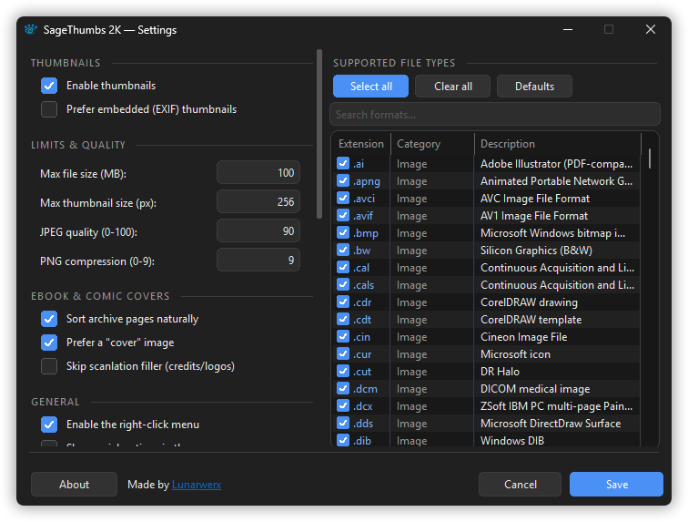
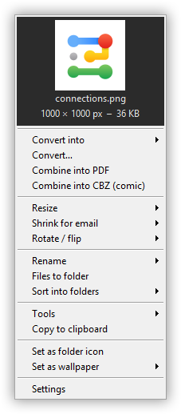
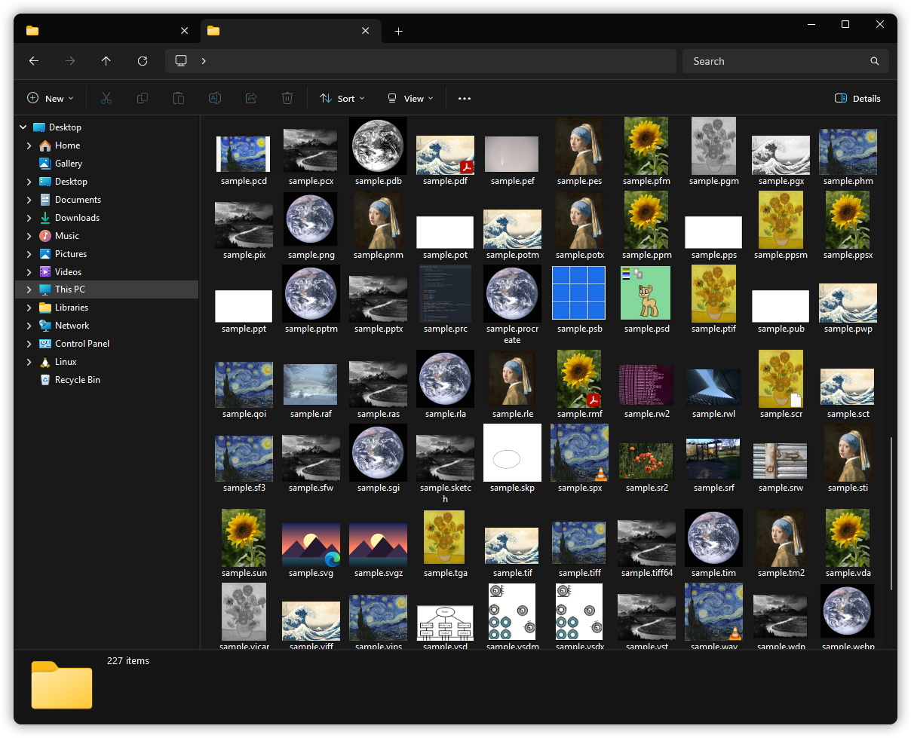

<div align="center">


# SageThumbs 2K

### Thumbnails for everything Windows won't show you.

A modern, **crash-isolated** Rust shell extension for **Windows 11** — the clean-room revival of the legendary (but decade-abandoned) [SageThumbs](https://sagethumbs.en.lo4d.com/).

[](#-install)
[](#-how-it-works)

[](https://github.com/LunarWerxs/SageThumbs-2k/releases)
[](https://github.com/LunarWerxs/SageThumbs-2k/releases)

[](#-license)
[](https://github.com/LunarWerxs/SageThumbs-2k/actions)

[**⬇ Download**](https://github.com/LunarWerxs/SageThumbs-2k/releases) · [Features](#-features) · [Formats](#-supported-formats) · [Build from source](#-build-from-source)

<br/>


&nbsp;


</div>

---

## TL;DR

- 🖼️ Explorer thumbnails for **310 file types it ignores** — camera RAW, Photoshop, HEIC/AVIF, **video (MKV, WebM, MP4, MOV…)**, JPEG-XR, MS Office, DjVu, ebooks & comics, 3D-print files, and the obscure long tail.
- 🛡️ **A corrupt or malicious file can't crash Explorer** — runs out-of-process, panic-guarded, with a sandboxed decoder.
- ⚡ **Fast even on big files** — camera RAW thumbnails from its embedded preview instead of a slow demosaic (3–13× quicker), and no format is allowed to hang a folder.
- 🧰 **Right-click toolkit:** convert, resize, lossless rotate, combine-to-PDF/CBZ, system-wide eyedropper, OCR, and more — all non-destructive, and **multi-file jobs run in parallel across every core**.
- 🎛️ **Make the menu yours** — **drag-reorder** (and show/hide) every right-click entry *and* its dividers; the context menu mirrors your layout exactly.
- 🎨 **Native Win11 UI**, system-following **dark mode**, **36 languages**.
- 🦀 100% clean-room **Rust**, **free for personal use** ([PolyForm Noncommercial](#-license)) — no GFL, no spyware, no personal data (just an [anonymous install count](#-privacy)).

> **[Download the installer →](https://github.com/LunarWerxs/SageThumbs-2k/releases)** Two clicks and your File Explorer just... works.

---

## Note from the Developer

> I'm a huge fan of SageThumbs. There are 4 things I always install on a new build, Chrome, XnShell, Everything and SageThumbs. Having noticed multiple system crashes from SageThumbs recently and no update in almost a decade, I decided it was time to right this injustice...
>
> After about a week, and an embarrassing amount of tokens, we now have a ground-up, rust native, alternative that now supports 310 formats, has no external dependencies, extensive red teaming, obsessively optimized for speed and install size, dozens of iterations through UI/UX for simplicity, menu editors, a color picker, screenshot tool, etc.
>
> Please tell your friends, star the repo and if you find anything broken, please let me know.

---

## The story

The original **SageThumbs** was a Windows legend — it made Explorer show thumbnails for *hundreds* of formats nothing else could. Then it stopped: no updates since ~2017, built on the proprietary, frozen **GFL** library.

**SageThumbs 2K rebuilds it from scratch in safe Rust** — a maintained decode pipeline, real crash isolation, and a native Windows 11 look — while keeping the one thing that made it great: **thumbnails for everything.**

---

## ✨ Features

|  |  |
|---|---|
| 🖼️ **310 formats** | Camera RAW (Canon/Nikon/Sony/Fuji/…), PSD, GIMP XCF, DICOM, OpenEXR, FITS, HEIC/AVIF, JPEG-2000/XL/**XR**, Targa, SGI, and more |
| 📚 **Ebooks & comics** | EPUB, MOBI/AZW (Kindle), FB2, CBZ/CB7/CBR/CBT — real covers in Explorer (a native-Rust [DarkThumbs](https://github.com/fire-eggs/DarkThumbs) port) |
| 🎨 **Art / CAD / 3D / design** | PSD/PSB, Affinity, Clip Studio, Krita, OpenRaster, Blender, 3MF, FreeCAD, G-code, **SketchUp, Rhino, AutoCAD DWG, 3ds Max, Adobe XD, InDesign, Visio, CorelDRAW** — preview pulled straight from inside the file (no host app needed) |
| 📄 **DjVu** | Pure-Rust, zero-GPL decode via [`djvu-rs`](https://crates.io/crates/djvu-rs) — scanned books show their text |
| 🔊 **Docs & audio** | PDF first page, Microsoft Office (Word/Excel/PowerPoint) & OpenDocument, and album art for MP3/FLAC/Ogg/Opus/M4A/**WMA**/… (WMA/ASF via a hand-rolled parser — Windows often can't) |
| 🧰 **Right-click toolkit** | Convert (29 targets), resize, shrink-for-email, **lossless** JPEG rotate/flip, combine→PDF/CBZ, batch rename from EXIF/tags, eyedropper, set-as-folder-icon, OCR, strip metadata |
| ⚡ **Parallel batch** | Multi-file Convert / Resize / Rotate / Strip and Combine-to-PDF fan out across **all CPU cores** (6–15× faster) — a tiny dependency-free scoped thread pool, no rayon bloat in the shell DLL |
| 🎛️ **Make the menu yours** | The Settings "Menu items" list lets you **drag-reorder** every right-click entry *and* its group dividers — the menu mirrors your layout exactly (WYSIWYG). Tick items off to hide them, or hit **Reset order** for the default |
| 🤖 **CLI + MCP server** | `st2k.exe` — `thumbnail · convert · batch · rotate · ocr · pdf · …` as a scriptable/AI-agent toolbox (`st2k --mcp`); **`batch`** parallel-processes whole folders in one process |
| 🛡️ **Crash-isolated** | Out-of-process, `catch_unwind` under `panic = "abort"`, sandboxed ImageMagick child (20s kill-timeout), decompression-bomb guards |
| 🌗 **Native Win11 UI** | Two-column Options dialog, Common-Controls v6, **system-following dark mode**, 36 languages |
| 🔍 **True transparency** | Real premultiplied-ARGB alpha — no more gray checkerboard behind transparent PNGs |

<div align="center">

</div>

---

## 📦 Install

1. **[Download `SageThumbs2K-Setup-<version>.exe`](https://github.com/LunarWerxs/SageThumbs-2k/releases)** and run it.
2. That's it — open any folder of exotic images.

- **Full** (~10.6 MB) bundles a hardened ImageMagick → all **310** formats.
- **Compact** skips ImageMagick → the pure-Rust + OS-codec formats only.

> The installer registers a classic shell extension via `regsvr32` and trusts a self-signed cert for the Win11 modern menu. It's a *classic* extension by design — not an MSIX sandbox — because it spawns ImageMagick as a subprocess.

> **First run / SmartScreen:** SageThumbs 2K is open-source indie software, and the installer isn't signed with a (paid) certificate — so Windows may show a blue **"Windows protected your PC"** screen. That's expected for unsigned indie apps: click **More info → Run anyway**. Every line of the code is right here for you to inspect.

---

## 🦀 How it works

```
IThumbnailProvider  →  runs in Explorer's isolated dllhost surrogate
        │  (first tier that decodes wins; SVG detected up front → resvg)
   image crate  →  WIC (OS codecs)  →  ImageMagick (sandboxed child)  →  headerless-Targa
  (safe Rust)      HEIC/AVIF/RAW       the obscure long tail             fallback
        │
        ▼   premultiplied-BGRA top-down DIB  →  Explorer (real alpha)
```

One DLL exposes three COM coclasses: the thumbnail provider, the modern `IExplorerCommand` menu, and a classic `IContextMenu` fallback. Settings live in `HKCU\Software\SageThumbs2K`.

---

## 🗂 Supported formats

<details open>
<summary><strong>310 extensions</strong> — Image 186 · RAW 34 · Ebook/comics 11 · Document 41 · Audio 16 · Video 22</summary>

- **RAW** — 3fr, arw, cr2/cr3/crw, dng, erf, iiq, mef, mrw, nef/nrw, orf, pef, raf, rw2, sr2/srw, x3f, …
- **Pro / scientific** — dcm (DICOM), dpx, cin, exr, fits, hdr, pfm
- **Photoshop / paint** — psd/psb, xcf, **psp/pspimage** (Paint Shop Pro), **iff/ilbm/lbm** (Amiga ILBM / Deluxe Paint), pcx, miff, cut
- **Common + modern** — png, jpg, gif, bmp, tiff, webp, heic/heif, avif, jp2, jxl, **jxr/wdp/hdp** (JPEG XR / HD Photo), dds, ico, tga, qoi, svg
- **Vector & metafile** — svg/svgz, wmf, emf/emz
- **Ebook & comics** — epub, mobi/azw/azw3, **prc** (Mobipocket), fb2/fbz, cbz/cb7/cbr/cbt
- **Project / design / CAD** — psd, afphoto/afdesign/afpub, clip, kra, ora, blend, 3mf, fcstd, gcode, **sketch, procreate** (digital art), **skp** (SketchUp), **3dm** (Rhino), **dwg** (AutoCAD), **max** (3ds Max), **c4d** (Cinema 4D), **xd** (Adobe XD), **cdr/cdt/cmx** (CorelDRAW / Corel Exchange)
- **Icons** — ico, cur, **icns** (Apple)
- **Docs & audio** — pdf, **doc/docx/docm, xls/xlsx/xlsm/xlsb, ppt/pptx/pptm/ppsx** (MS Office), odt/ods/odp, **key/pages/numbers** (Apple iWork), **indd** (InDesign), **vsd/vsdx/vsdm** (Visio), **pub** (Publisher), djvu + mp3/flac/ogg/opus/m4a/wma/ape/…

*(PostScript/video/font coders are excluded for safety. PDF uses the in-box OS renderer.)*

</details>

---

## 🔧 Build from source

Requires the **MSVC** Rust toolchain, VS Build Tools (Desktop C++), and — for the installer — [Inno Setup](https://jrsoftware.org/isinfo.php).

```powershell
cargo build --release            # sagethumbs2k.dll + sagethumbs2k-app.exe + st2k.exe
.\scripts\build-release.ps1      # full pipeline → dist\SageThumbs2K-Setup-<ver>.exe
```

---

## 🔒 Privacy

No accounts, no profiles, no ad-tracking, no selling anything — and the whole thing is right here in the source. The honest version:

**What checks in:** on startup the app fetches a small sponsor file from our server (the same fetch that decides whether a sponsor banner shows). That one request carries three non-personal things so we can keep a rough **install + usage count**:

- the **app version** (e.g. `0.4.5`),
- the **Windows generation + build** (e.g. `win11-22631`),
- a one-time **"fresh install"** marker, only the very first time a new install ever checks in.

**What it never sends:** no name, email, account, or device ID; no file names, paths, or contents; and we don't store your IP. There's **no per-machine identifier**, so we can count installs but can't follow you across sessions.

**Why:** so we know roughly how many people use SageThumbs 2K and which versions/OSes to keep supporting. Bragging rights and prioritization — nothing more.

It's a small [Cloudflare Worker](packaging/analytics/), the beacon is visible in [`sponsors.rs`](src/bin/app/sponsors.rs), and the download badge up top is just GitHub's own public counter.

---

## 📜 License

**[PolyForm Noncommercial License 1.0.0](.github/LICENSE.md)** — free to use, modify, and share for any **noncommercial** purpose. **Commercial use requires a separate license** ([open an issue](https://github.com/LunarWerxs/SageThumbs-2k/issues) to arrange one). © 2026 Lunarwerx.

SageThumbs 2K is a **clean-room rewrite** — **not** a derivative of the GPLv2 C++ original, and it uses **no GFL**. Every decoder is pure-Rust or an OS codec (RAR/CBR comics use the pure-Rust [`rars`](https://crates.io/crates/rars) crate — no proprietary UnRAR), so the project's own code is entirely original and its dependencies are permissively licensed — which is what lets us license it as we choose. The optional bundled ImageMagick (for the exotic long tail) ships under its own permissive license and runs only as a sandboxed subprocess.

## 🙏 Credits

A from-scratch successor to Nikolay Raspopov's original **[SageThumbs](https://github.com/raspopov/SageThumbs)** (2004–2017, GPLv2, now unmaintained) — rebuilt clean-room in Rust, with our thanks for the classic that inspired it. Built on [image-rs](https://github.com/image-rs/image), [resvg](https://github.com/linebender/resvg), [windows-rs](https://github.com/microsoft/windows-rs), [djvu-rs](https://crates.io/crates/djvu-rs), and [ImageMagick](https://imagemagick.org/).

With thanks to the projects that shaped specific features:

- [**DarkThumbs**](https://github.com/fire-eggs/DarkThumbs) — the model for the ebook & comic cover thumbnails (EPUB / MOBI / FB2 / CBZ…).
- [**Flameshot**](https://flameshot.org/) — inspiration for the screenshot capture + annotation flow.
- [**XnShell / XnView**](https://www.xnview.com/) — inspiration for the right-click image toolkit and shell-menu UX.
- [**Calibre**](https://calibre-ebook.com/) — reference for ebook formats and cover extraction.

<div align="center">
<sub>Made with 🦀 for people who have too many weird files.</sub>
</div>
