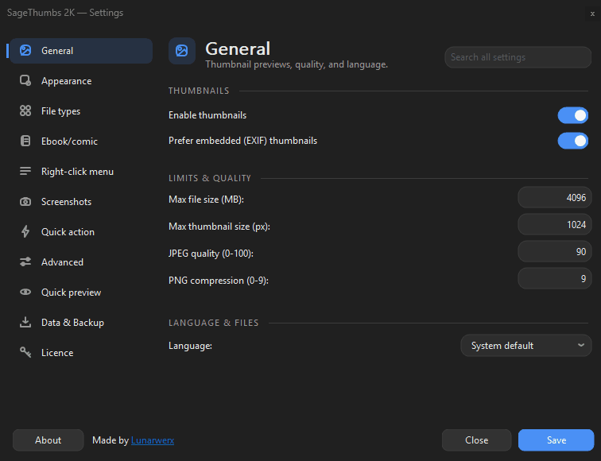
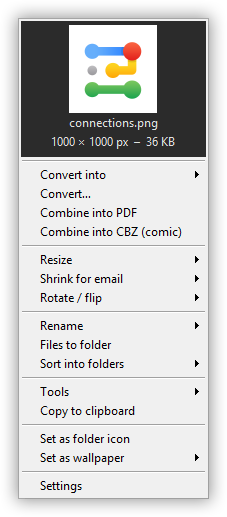
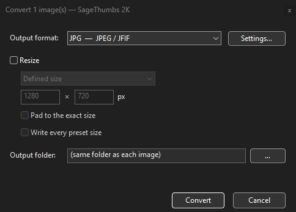
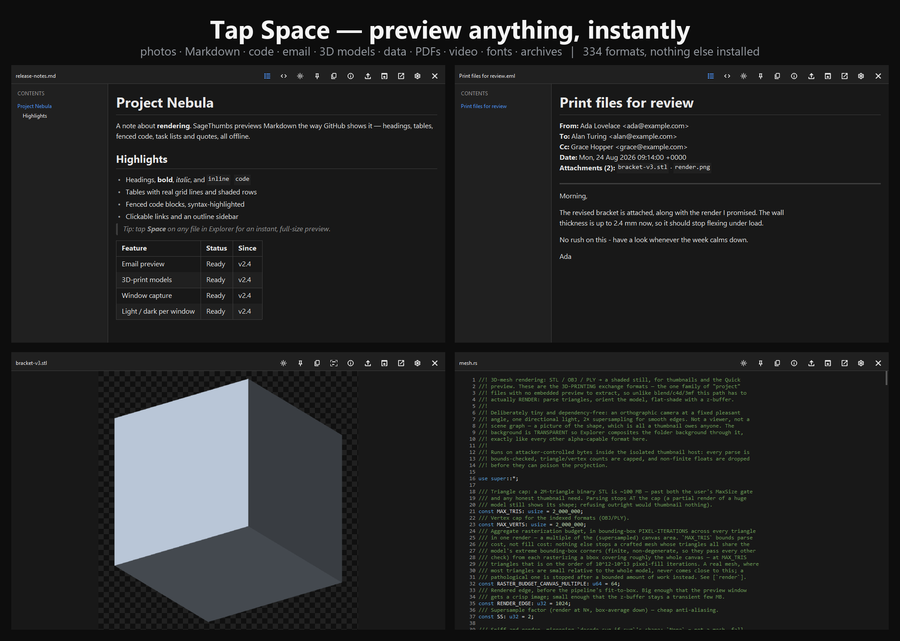
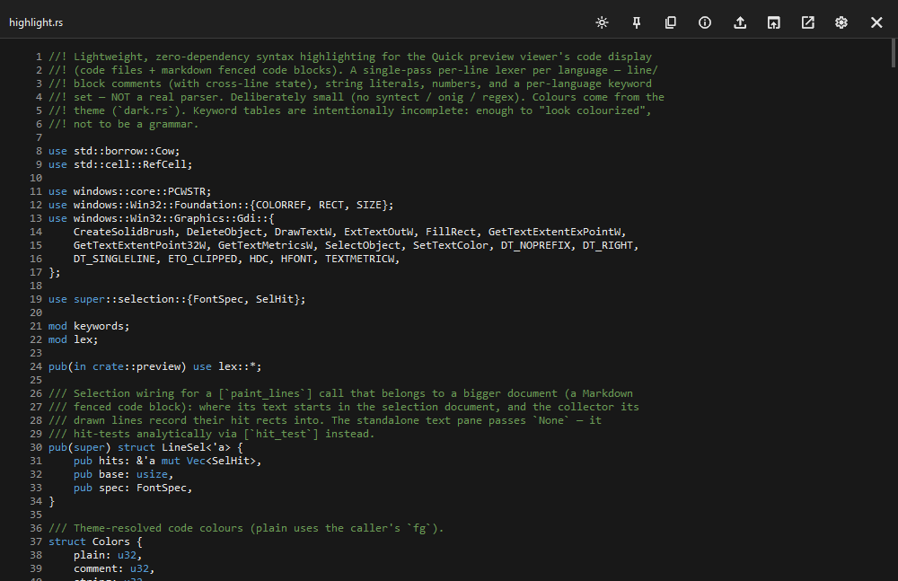
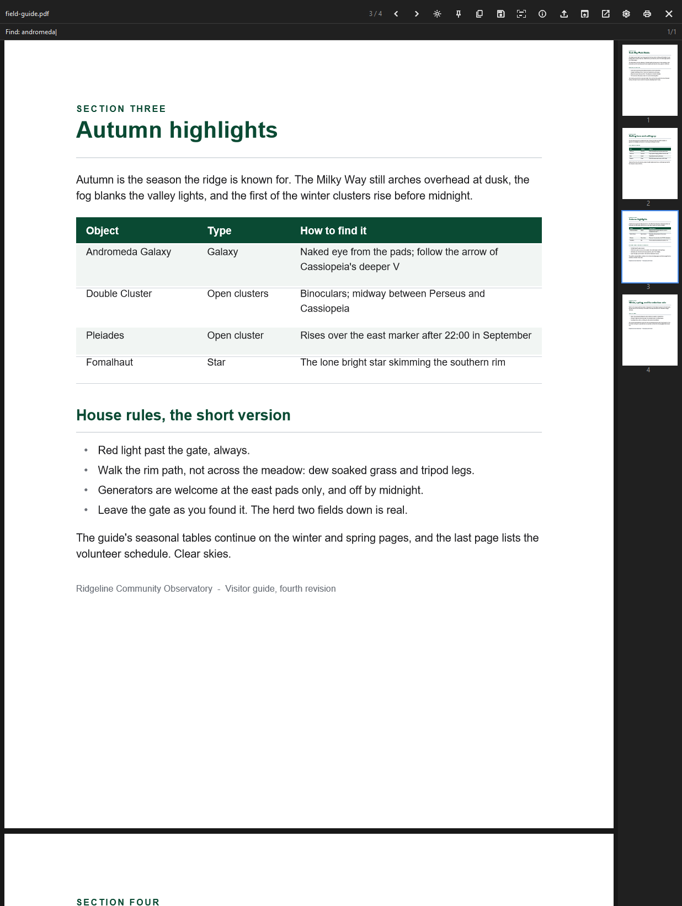
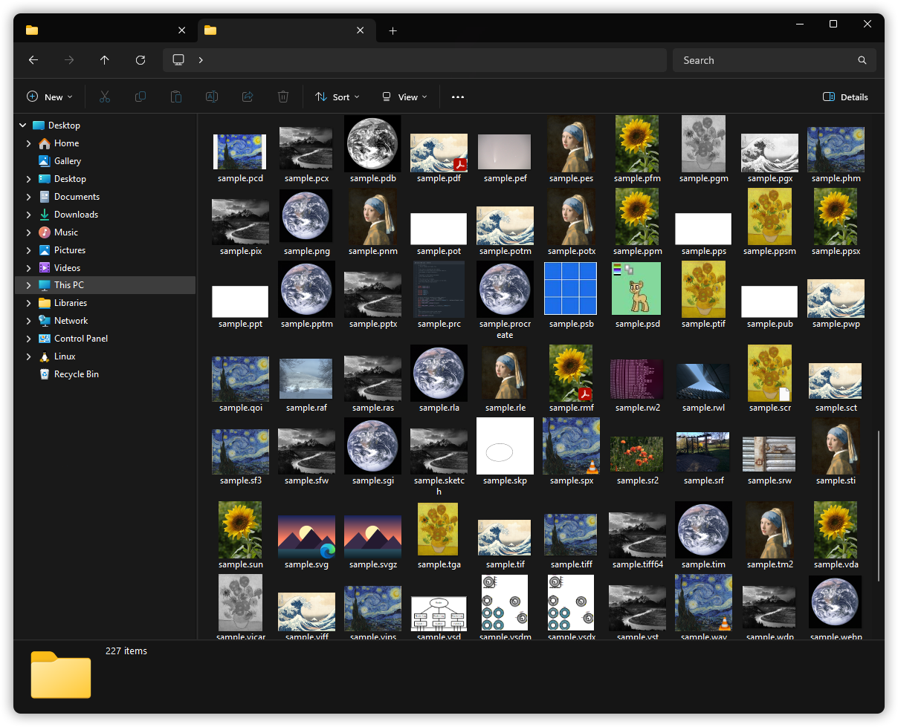

<div align="center">


# SageThumbs 2K

### Thumbnails for everything Windows won't show you.

A modern, **crash-isolated** Rust shell extension for **Windows 11**: the clean-room revival of the legendary (but decade-abandoned) [SageThumbs](https://sagethumbs.en.lo4d.com/).

[](#-install)
[](#-how-it-works)

[](https://github.com/LunarWerxs/SageThumbs-2k/releases)
[](#-license)
[](https://github.com/LunarWerxs/SageThumbs-2k/actions)

<a href="https://sourceforge.net/projects/sagethumbs-2k/"></a>

[**⬇ Download**](https://github.com/LunarWerxs/SageThumbs-2k/releases) · [Features](#-features) · [Formats](#-supported-formats) · [FAQ](https://github.com/LunarWerxs/SageThumbs-2k/blob/main/docs/FAQ.md) · [Changelog](https://github.com/LunarWerxs/SageThumbs-2k/blob/main/docs/CHANGELOG.md) · [Build from source](#-build-from-source)

<br/>


&nbsp;


<br/><br/>



<br/><br/>



<br/><br/>



<br/><br/>



</div>

SageThumbs 2K is a crash-isolated Rust shell extension for Windows 11 that adds File Explorer thumbnails, a right-click image toolkit, and a QuickLook-style preview for 334 file types Windows can't render natively, including camera RAW, Photoshop PSD, HEIC/AVIF, video, ebooks, comics, and the long tail of obscure formats.

---

## TL;DR

- 🖼️ Explorer thumbnails for **334 file types it ignores**: camera RAW, Photoshop, HEIC/AVIF, **video (MKV, WebM, MP4, MOV…)**, JPEG-XR, MS Office, DjVu, ebooks & comics, 3D-print files, and the obscure long tail.
- 🛡️ **A corrupt or malicious file can't crash Explorer**: runs out-of-process, panic-guarded, with a sandboxed decoder.
- ⚡ **Fast even on big files**: camera RAW thumbnails from its embedded preview instead of a slow demosaic (3–13× quicker), and no format is allowed to hang a folder.
- 🧰 **Right-click toolkit:** convert, resize, lossless rotate, combine-to-PDF/CBZ, system-wide eyedropper, OCR, and more; all non-destructive, and **multi-file jobs run in parallel across every core**.
- 👁️ **Press Space to preview** any file, QuickLook-style: an instant full-size popup with **video & audio playback**, **syntax-highlighted** code, **rendered Markdown**, **multi-page PDF** paging, **font specimens**, **archive listings**, **SQLite databases** (tables, columns and rows, read-only), **email files** (.eml and Outlook .msg: headers, body and the attachment list, with nothing fetched from the web), **3D-print models** (STL/OBJ/PLY, shaded), a **light/dark button on the window itself** (for the dark photo or bright scan that reads better the other way round), arrow-key folder browsing and full-screen (F11). Works in Explorer, on the Desktop, in **[Everything](https://www.voidtools.com/) search results**, and inside any app's **Open/Save dialog**.
- 🔤 **Copy text off your screen**: drag a region and the words land on your clipboard, in an editable window so you can fix a misread. Uses Windows' own recognizer, so it adds nothing to the download.
- 🎛️ **Make the menu yours**: **drag-reorder** (and show/hide) every right-click entry *and* its dividers; the context menu mirrors your layout exactly.
- 🎨 **Redesigned Settings**: a Win11-style category nav rail with toggle switches, a **search box that finds any setting on any page**, system-following **dark mode**, **36 languages**.
- 🦀 100% clean-room **Rust**, **free for personal use** ([PolyForm Noncommercial](#-license)); no GFL.

> **[Download the installer →](https://github.com/LunarWerxs/SageThumbs-2k/releases)** Two clicks and your File Explorer just... works.

---

## Note from the Developer

> I'm a huge fan of SageThumbs. There are 4 things I always install on a new build, Chrome, XnShell, Everything and SageThumbs. Having noticed multiple system crashes from SageThumbs recently and no update in almost a decade, I decided it was time to right this injustice...
>
> After about a week, and an embarrassing amount of tokens, we now have a ground-up, rust native, alternative that now supports hundreds of formats, extensive red teaming, obsessively optimized for speed with carefully audited packaging, dozens of iterations through UI/UX for simplicity, menu editors, a color picker, screenshot tool, etc.
>
> Please tell your friends, star the repo and if you find anything broken, please let me know.

---

## The story

The original **SageThumbs** was a Windows legend. It made Explorer show thumbnails for *hundreds* of formats nothing else could. Then it stopped: no updates since ~2017, built on the proprietary, frozen **GFL** library.

**SageThumbs 2K rebuilds it from scratch in safe Rust** (a maintained decode pipeline, real crash isolation, and a native Windows 11 look) while keeping the one thing that made it great: **thumbnails for everything.**

---

## ✨ Features

|  |  |
|---|---|
| 🖼️ **334 formats** | Camera RAW (Canon/Nikon/Sony/Fuji/…), PSD, GIMP XCF, DICOM, OpenEXR, FITS, HEIC/AVIF, JPEG-2000/XL/**XR**, Targa, SGI, and more |
| 📚 **Ebooks & comics** | EPUB, MOBI/AZW (Kindle), FB2, CBZ/CB7/CBR/CBT: real covers in Explorer (a native-Rust [DarkThumbs](https://github.com/fire-eggs/DarkThumbs) port). Plain ZIP/RAR/7Z archives within the configured file-size limit get a contact-sheet thumbnail of the images inside, too |
| 🎨 **Art / CAD / 3D / design** | PSD/PSB, Affinity, Clip Studio, Krita, OpenRaster, Blender, 3MF, FreeCAD, G-code, **SketchUp, Rhino, AutoCAD DWG, 3ds Max, Adobe XD, InDesign, Visio, CorelDRAW, Fusion 360 (.f3d)**: preview pulled straight from inside the file (no host app needed) |
| 📄 **DjVu** | Pure-Rust, zero-GPL decode via [`djvu-rs`](https://crates.io/crates/djvu-rs); scanned books show their text |
| 🔊 **Docs & audio** | PDF first page, Microsoft Office (Word/Excel/PowerPoint) & OpenDocument, and album art for MP3/FLAC/Ogg/Opus/M4A/**WMA**/**DSF (DSD)**/… (WMA/ASF and DSD/.dsf via hand-rolled parsers; `lofty` can't read either) |
| 👁️ **Space-bar preview** | Tap **Space** in Explorer (or on the Desktop) for an instant QuickLook-style popup of the selected file: any supported format at full size, plus **video & audio playback** (with a scrubber + volume), **syntax-highlighted** code, **GitHub-style rendered Markdown**, animated GIF/APNG/WebP, a real **PDF viewer** (continuous scrolling, a clickable page-thumbnail strip, zoom that re-renders sharp, and **Ctrl+F text search** via Windows' built-in OCR), **font specimens** (.ttf/.otf/.ttc), **archive listings** (zip/7z/rar), **SQLite databases** (.db/.sqlite: every table's columns and first rows, plus the schema, strictly read-only), **←/→ folder browsing** and **full-screen (F11)**. The caption toolbar carries a **light/dark toggle for that window alone**, independent of the app theme, and a **gear** that opens the Quick preview settings. Optionally renders local HTML in a locked-down WebView2 (scripts off, no network) when enabled. Off by default; opt in from Settings |
| 🧰 **Right-click toolkit** | Convert (29 targets), resize, shrink-for-email, **lossless** JPEG rotate/flip, combine→PDF/CBZ, batch rename from EXIF/tags, eyedropper, set-as-folder-icon, OCR, strip metadata, upload-to-catbox (copy link) |
| ⚡ **Parallel batch** | Multi-file Convert / Resize / Rotate / Strip and Combine-to-PDF fan out across **all CPU cores** (6–15× faster): a tiny dependency-free scoped thread pool, no rayon bloat in the shell DLL |
| 🎛️ **Make the menu yours** | The Settings "Menu items" list lets you **drag-reorder** every right-click entry *and* its group dividers: the menu mirrors your layout exactly (WYSIWYG). Tick items off to hide them, or hit **Reset order** for the default |
| 🤖 **CLI + MCP server** | `st2k.exe`: `thumbnail · convert · batch · rotate · ocr · pdf · …` as a scriptable/AI-agent toolbox (`st2k --mcp`); **`batch`** parallel-processes whole folders in one process. The MCP server adds **`view`** (decode any supported format to a PNG block so an AI agent can *see* the file) and **`compress`** tools |
| 📇 **Details pane & columns** | An **IPropertyStore** handler surfaces image dimensions, EXIF camera info and audio tags in Explorer's Details pane, hover tooltips, and sortable/groupable columns, for the 334 formats Windows can't read itself. Read-only and panic-isolated, like the thumbnailer |
| 🎨 **Colour management** | Embedded **ICC** profiles and wide-gamut images (**Display P3 / Adobe RGB**) render in correct sRGB instead of over-saturated; AVIF/HEIC read their `colr` box (incl. the iPhone-HEIC CICP Display-P3 signal), and **CMYK JPEGs** are colour-managed through their embedded profile; pure-Rust, no C deps |
| 🔧 **Repair file associations** | One button in **Settings ▸ Diagnostics** re-registers SageThumbs for every enabled format when another app has hijacked the thumbnails, then clears the thumbnail cache |
| 🛡️ **Crash-isolated** | Out-of-process, `catch_unwind` under `panic = "abort"`, sandboxed ImageMagick child (CPU-time budget + kill-timeout), decompression-bomb guards |
| 🌗 **Native Win11 UI** | Redesigned **Settings**: a Win11-style category nav rail (General · Appearance · File types · Ebook/comic · Right-click menu · Screenshots · Quick action · Advanced · Quick preview · Data & Backup) with toggle switches, Common-Controls v6, a **search box that finds any setting on any page**, **light/dark theme** (follow Windows, or pick your own), 36 languages |
| 🔤 **Screen OCR** | **Copy text (OCR)** wherever you need it: a button in the screenshot editor (or **Ctrl+T**), a button on the Quick preview toolbar, a one-click tray item, or a global hotkey that goes straight to drag-a-region-get-the-text. The words land on your clipboard *and* in an editable window, so a misread character is fixable before you paste. Small on-screen type is enlarged before it's read, which is what the in-box recognizer needs to see it at all |
| 💬 **Send feedback** | A box in the About card mails a suggestion, bug report or format request straight to the developer: no GitHub account, no email address required (leave one only if you want a reply). A failed send puts your text on the clipboard so nothing is lost |
| 🔍 **True transparency** | Real premultiplied-ARGB alpha, so Explorer shows the folder background through a transparent PNG instead of a baked-in grey grid. Prefer the classic look? One switch puts the checkerboard back |

<div align="center">

</div>

---

## 🧹 One install, a whole stack gone

There's a checklist of little utilities people reinstall on every new Windows box: a thumbnail/codec pack, a converter, a color picker, a screenshot tool, an EXIF viewer. SageThumbs 2K is one shell extension (plus a single `st2k.exe`) that quietly does all of their jobs, with no accounts to create and no cloud service to sign into.

| Instead of installing... | You already have it |
|---|---|
| A RAW/PSD/HEIC **thumbnail or codec pack** (MysticThumbs, FastPictureViewer, Icaros) | Thumbnails for **334 formats**, crash-isolated so a corrupt file can't hang Explorer |
| A **preview-pane** add-on for RAW/PSD/ebook covers | A built-in large **preview handler** for 334 formats (reading pane and Open dialogs) |
| A **Space-bar preview** app (QuickLook, Seer) | Tap Space for an instant full-size preview, macOS-style: video plays, code is syntax-highlighted, Markdown renders, PDFs page, SQLite databases open as tables **(new)** |
| An **EXIF / metadata viewer** (ExifToolGUI, Opanda IExif) | EXIF, GPS, dimensions and audio tags as **sortable Explorer columns** |
| A **batch converter** (XnConvert, IrfanView + plugins, ImageMagick) | Right-click **Convert** to ~29 formats (AVIF, JPEG XL, PSD, DDS, EXR...), batched across every core |
| A **resizer** (PowerToys Image Resizer) | Right-click **Resize** presets and **Shrink for email** |
| **jpegtran**, or IrfanView's lossless-rotate plugin | **Lossless JPEG rotate / flip**, zero re-encode |
| A **color picker** (PowerToys, Just Color Picker, Instant Eyedropper) | A **system-wide eyedropper** with a 10x loupe; copies **hex, rgb(), hsl() or hsv()** (Tab switches) and keeps your **last 10 picks** a keypress away |
| A **metadata scrubber** (ExifCleaner, BatchPurifier) | Right-click **Strip metadata** (EXIF/IPTC/XMP/GPS), keeps your ICC profile |
| A **screenshot + annotate** app (ShareX, Greenshot, Snagit) | Built-in capture: **drag a region or click a window**, an optional **countdown delay** for menus and tooltips, an annotation editor and quick-save |
| An **OCR** tool (Capture2Text, PowerToys Text Extractor) | **Copy text (OCR)** four ways: right-click a file, **Ctrl+T** in the screenshot editor, the Quick preview toolbar, or a one-key hotkey / tray click that goes straight to drag-a-region-get-the-text; **captured tables keep their columns** (tabs, so they paste into Excel as cells) |
| An **image uploader** (ShareX, Imgur apps) | **Upload (copy link)** to a keyless host, no account |
| A **PDF / CBZ maker** (PDF24, manual 7-Zip) | **Combine into PDF** or **CBZ**, natural-sorted |
| **ImageMagick** for scripts and AI agents | `st2k.exe`: a full CLI **and an MCP server**, so agents get an image toolbox with zero extra installs |

**That's a dozen-plus tools folded into one tiny download** with no separate codec pack to install and every decoder isolated from Explorer. The thumbnailer runs only when Explorer asks it for a thumbnail; the background helper for the screenshot hotkey and Space-bar preview is opt-in, so a default install has nothing resident at all.

<sub>Fine print, because we'd rather undersell: a few exotic formats lean on codecs already in Windows (WIC) or the bundled ImageMagick engine rather than pure Rust; SageThumbs 2K is what wires all of it into Explorer. And several tools above (PowerToys, Snipping Tool, ShareX) are free too. The point isn't that they cost money, it's that you no longer have to assemble and run a dozen of them side by side.</sub>

---

## ⭐ Like it? Help it grow

Built in the open by one person, free for personal use, no ads, no paywall. If SageThumbs 2K earns a spot on your "install on every new PC" list, a few seconds of support goes a *long* way:

- ⭐ **[Star the repo](https://github.com/LunarWerxs/SageThumbs-2k)**: the single biggest signal that this is worth maintaining.
- 📝 **[Leave a review on SourceForge](https://sourceforge.net/projects/sagethumbs-2k/)**: helps people find a thumbnailer they can actually trust.
- 👍 **[Like it on AlternativeTo](https://alternativeto.net/software/sagethumbs-2k/about/)**: surfaces it for everyone searching for a SageThumbs / DarkThumbs alternative.

Hit a bug, or a format that won't thumbnail? **[Open an issue](https://github.com/LunarWerxs/SageThumbs-2k/issues)**, that helps just as much.

---

## 📦 Install

1. **[Download `SageThumbs2K-Setup-<version>.exe`](https://github.com/LunarWerxs/SageThumbs-2k/releases)** and run it.
2. That's it: open any folder of exotic images.

- There is **one payload**: the bundled ImageMagick engine is always installed, so every
  supported format works out of the box. (Older releases offered a cut-down "Compact" choice
  that dropped it; upgrading replaces that with the complete engine.)
- **ARM64** ships as a separate `SageThumbs2K-Setup-<ver>-arm64.exe` for Windows on
  Arm, running natively rather than emulated, with the same engine as x64, so format
  coverage is identical on both.

> The installer registers a classic shell extension via `regsvr32` and trusts a self-signed cert for the Win11 modern menu. It's a *classic* extension by design (not an MSIX sandbox) because it spawns ImageMagick as a subprocess.

> **First run / SmartScreen:** SageThumbs 2K is source-available indie software, and the installer isn't signed with a (paid) certificate, so Windows may show a blue **"Windows protected your PC"** screen. That's expected for unsigned indie apps: click **More info → Run anyway**. Every line of the code is right here for you to inspect.

### Installer vs. portable zip

Prefer nothing touching the registry outside your own account, or can't run an installer at all? Grab the **portable zip** from the same [releases page](https://github.com/LunarWerxs/SageThumbs-2k/releases) instead. It covers most of the app, but not quite everything:

| | Installer | Portable zip |
|---|---|---|
| Explorer thumbnails | ✅ | ✅ (per-user, no admin) |
| Classic right-click menu | ✅ | ✅ (per-user, no admin) |
| Settings, Convert/Resize, Quick preview, screenshots, OCR, eyedropper, CLI | ✅ | ✅ |
| Explorer **preview pane** | ✅ | ❌ |
| **Details pane** (columns, EXIF/tags) | ✅ | ❌ |
| Modern Windows 11 right-click menu | ✅ | ❌ |

The three ❌ rows all need machine-wide registration, which is exactly what the portable zip is built to avoid. If you want those too, use the installer.

---

## 🦀 How it works

```
IThumbnailProvider  →  runs in Explorer's isolated dllhost surrogate
        │  (first tier that decodes wins; SVG detected up front → resvg)
   image crate  →  WIC (OS codecs)  →  ImageMagick (sandboxed child)  →  headerless-Targa
  (safe Rust)      HEIC/AVIF/RAW       the obscure long tail             fallback
        │
        ▼   premultiplied-BGRA top-down DIB  →  Explorer (real alpha)
```

One DLL exposes three COM coclasses: the thumbnail provider, the modern `IExplorerCommand` menu, and a classic `IContextMenu` fallback. Settings live in `HKCU\Software\SageThumbs2K`.

---

## 🛠 Built like it matters

Most thumbnail handlers are a weekend hack. This one's been put through the wringer:

- **Crash-proof by design**: a malformed file can't take down Explorer.
- **Zero runtime dependencies**, pure memory-safe Rust core, installs clean every time.
- **Zero-warning linting, supply-chain audits, fuzzing, Miri, and a full test + render-regression suite** gate every release.
- **Hardened against hostile input** and scanned through VirusTotal each release.
- **Color-managed** (ICC/wide-gamut → sRGB) and **obsessively tuned** for speed, size, and a native feel.

---

## 🗂 Supported formats

<details open>
<summary><strong>334 extensions</strong> across Image, RAW, Ebook/comics, Document, Audio and Video</summary>

- **RAW**: 3fr, arw, cr2/cr3/crw, dng, erf, iiq, mef, mrw, nef/nrw, orf, pef, raf, rw2, sr2/srw, x3f, …
- **Pro / scientific**: dcm (DICOM), dpx, cin, exr, fits, hdr, pfm
- **Photoshop / paint**: psd/psb, xcf, **psp/pspimage** (Paint Shop Pro), **iff/ilbm/lbm** (Amiga ILBM / Deluxe Paint), pcx, miff, cut
- **Common + modern**: png, jpg, gif, bmp, tiff, webp, heic/heif, avif, jp2, jxl, **jxr/wdp/hdp** (JPEG XR / HD Photo), **dds** (game textures: every block format BC1 to BC7, HDR BC6H included, decoded natively), ico, tga, qoi, svg
- **Vector & metafile**: svg/svgz, wmf, emf/emz
- **Ebook & comics**: epub, mobi/azw/azw3, **prc** (Mobipocket), fb2/fbz, cbz/cb7/cbr/cbt
- **Project / design / CAD**: psd, afphoto/afdesign/afpub, clip, kra, ora, blend, 3mf, fcstd, gcode, **eps** (embedded raster preview only), **sketch, procreate** (digital art), **skp** (SketchUp), **3dm** (Rhino), **dwg** (AutoCAD), **max** (3ds Max), **c4d** (Cinema 4D), **xd** (Adobe XD), **cdr/cdt/cmx** (CorelDRAW / Corel Exchange)
- **Icons**: ico, cur, **icns** (Apple)
- **Docs & audio**: pdf, **doc/docx/docm, xls/xlsx/xlsm/xlsb, ppt/pptx/pptm/ppsx** (MS Office), odt/ods/odp, **key/pages/numbers** (Apple iWork), **indd/indt** (InDesign), **vsd/vsdx/vsdm** (Visio), **pub** (Publisher), djvu + mp3/flac/ogg/opus/m4a/wma/**dsf** (DSD)/ape/…
- **Video**: mkv/webm, mp4/m4v/mov, avi, wmv, flv, mpg/mpeg, 3gp/3g2, ts/m2ts/mts, ogv, divx, …: a representative frame (30% in by default, adjustable in Settings) via the OS **Media Foundation** codecs, plus **FLV** (VP6 / Sorenson Spark) and **HDR VP9** (Profile 2/3, 10- and 12-bit) decoded by SageThumbs itself in a short-lived helper process

*(PostScript without an embedded raster preview and font-only ImageMagick coders are excluded for safety; PDF uses the in-box OS renderer. Video frames normally come from Windows' own Media Foundation codecs. Where Windows has no codec (FLV's VP6 and Sorenson Spark, and VP9 Profile 2/3 HDR), SageThumbs decodes the frame itself in a separate short-lived process, so a corrupt file costs one thumbnail rather than disturbing Explorer. Anything neither side can decode, such as MPEG-1/2 without the optional pack, keeps its default icon.)*

</details>

---

## 🔧 Build from source

Requires the **MSVC** Rust toolchain, VS Build Tools (Desktop C++), and (for the installer) [Inno Setup](https://jrsoftware.org/isinfo.php).

```powershell
$env:RUSTFLAGS = '-C target-feature=+crt-static'   # static CRT: see note below
cargo build --release            # sagethumbs2k.dll + SageThumbs2K.exe + st2k.exe
.\scripts\build-release.ps1      # full pipeline → dist\SageThumbs2K-Setup-<ver>.exe
.\scripts\build-release.ps1 -Architecture arm64  # ARM64 installer
```

> ARM64 cross-builds additionally need the ARM64 MSVC C++ tools installed through Visual
> Studio Build Tools. The ARM64 release path produces a separately named
> installer; it is not a replacement for the x64 Full build.

> `scripts\build-release.ps1` always sets `crt-static` itself, so a release build is
> reproducible from a fresh clone either way, but a **plain `cargo build --release`**
> without it links the DLL against the MSVC CRT dynamically, which can fail
> `regsvr32`/`DllRegisterServer` with `0x8007007E` (`ERROR_MOD_NOT_FOUND`) on a machine
> missing the VC++ Redistributable. Set the flag yourself (as above) if you're building
> the DLL directly rather than through the release pipeline.

---

## FAQ

### Is SageThumbs 2K free?

Yes, for personal use, under the [PolyForm Noncommercial License 1.0.0](#-license). Commercial
use needs a separate license (open an issue to arrange one). There's no ads, no paywall, and no
subscription tier, just a single free download built and maintained by one person.

### What are the system requirements?

Windows 11, 64-bit. It ships as a native x64 installer, plus a separately built native ARM64
installer for Windows on Arm with the same format coverage. There's also a portable zip for
per-user use with no admin rights. No other software is required: the installer bundles
everything it needs, including the ImageMagick engine used for the more obscure formats.

### Does it replace File Explorer, or install its own file browser?

Neither. It's a shell extension that plugs into the existing File Explorer: same windows, same
navigation, just real thumbnails, a right-click toolkit, and a Space-bar preview added on top.
Nothing about how you browse files changes.

### Why did Windows or my antivirus flag the installer?

Because it is unsigned and every release is a brand-new file the world has never seen. That is
a *reputation* verdict, not a finding about the code, and the detection names say so
themselves: Microsoft's `Wacatac.B!ml` ends in `!ml`, its own marker for "a machine-learning
model guessed"; Fortinet reports `PossibleThreat`; Rising reports `Undefined`; Skyhigh reports
`BehavesLike`. None of them claims to have recognised anything specific.

Two measurements, taken on 2026-08-31, if you would rather not take our word for it. They
are dated on purpose: these numbers move, which is the entire point being made.

- **The count moves on its own, with no change to the software.** A freshly built installer,
  the same product, scanned the same day: **2 of 71** engines. The published build of that
  identical version, four days and a few hundred downloads later: **9 of 71**. Same program,
  same code, engines simply score a file more as it circulates. Older releases settle back
  down again (1.2.2 sits at 1 of 75).
- **Removing half the installer changes nothing.** We built a variant with the entire bundled
  ImageMagick engine stripped out, halving the download, and scanned both within ten minutes of
  each other: 2 of 71 with it, 3 of 70 without. The size and contents are not what is being
  scored.

Every release links its own VirusTotal report, so you can see the current ratio and the exact
engine names for the file you downloaded rather than one popup's opinion. You can also verify
the SHA-256 on the release page matches what you got.

If your antivirus quarantines it, reporting it as a false positive to *your* vendor genuinely
helps, those reports are what clear it for everyone else using that product. Code signing is
the durable fix and is planned.

SmartScreen's "Windows protected your PC" screen is a separate thing: it is the same
no-history-yet reputation prompt rather than a malware verdict. Click **More info**, then
**Run anyway**.

### How is it different from the original SageThumbs, or a tool like MysticThumbs?

It's a clean-room rebuild of the classic, decade-abandoned SageThumbs (2004-2017, GPLv2, no
GFL reused), written from scratch in memory-safe Rust. Compared to a codec-pack style
thumbnailer like MysticThumbs, its thumbnail provider runs out-of-process and panic-guarded, so
a corrupt or hostile file can't take down Explorer the way an in-process crash can.

### Does the Space-bar preview work with the Everything search tool?

Yes, both Everything 1.4 and 1.5, installed or portable. Click a result first, since Space typed
into the search box just types a space. If Everything itself runs as administrator, Windows
blocks the keypress from reaching any normal program; binding a hotkey with Ctrl, Alt, or Shift
in Settings works around that, because Windows delivers hotkeys differently than typed keys.

### How many formats does it support, and can more be added?

334 as of this README, across image, camera RAW, ebook/comic, document, audio, and video; run
`st2k formats` for the live, per-category count. New formats are considered when they can be
read without a heavy dependency, many "project" file formats bake in a preview image that's
cheap to extract. Request one through Send Feedback in the app or a GitHub issue.

---

## 📜 License

**[PolyForm Noncommercial License 1.0.0](https://github.com/LunarWerxs/SageThumbs-2k/blob/main/.github/LICENSE.md)**: free to use, modify, and share for any **noncommercial** purpose. **Commercial use requires a separate license** ([open an issue](https://github.com/LunarWerxs/SageThumbs-2k/issues) to arrange one). © 2026 Lunarwerx.

SageThumbs 2K is a **clean-room rewrite**, **not** a derivative of the GPLv2 C++ original, and it uses **no GFL**. Every decoder is pure-Rust or an OS codec (RAR/CBR comics use the pure-Rust [`rars`](https://crates.io/crates/rars) crate, no proprietary UnRAR), so the project's own code is entirely original and its dependencies are permissively licensed, which is what lets us license it as we choose. The optional bundled ImageMagick (for the exotic long tail) ships under its own permissive license and runs only as a sandboxed subprocess.

## 🙏 Credits

A from-scratch successor to Nikolay Raspopov's original **[SageThumbs](https://github.com/raspopov/SageThumbs)** (2004–2017, GPLv2, now unmaintained), rebuilt clean-room in Rust, with our thanks for the classic that inspired it. Built on [image-rs](https://github.com/image-rs/image), [resvg](https://github.com/linebender/resvg), [windows-rs](https://github.com/microsoft/windows-rs), [djvu-rs](https://crates.io/crates/djvu-rs), and [ImageMagick](https://imagemagick.org/).

With thanks to the projects that shaped specific features:

- [**DarkThumbs**](https://github.com/fire-eggs/DarkThumbs): the model for the ebook & comic cover thumbnails (EPUB / MOBI / FB2 / CBZ…).
- [**Flameshot**](https://flameshot.org/): inspiration for the screenshot capture + annotation flow.
- [**XnShell / XnView**](https://www.xnview.com/): inspiration for the right-click image toolkit and shell-menu UX.
- [**Calibre**](https://calibre-ebook.com/): reference for ebook formats and cover extraction.

<div align="center">

Made by [LunarWerx Studios](https://lunarwerx.com): also see [RepoYeti](https://repoyeti.com), [QuickDictate](https://quickdictate.lunarwerx.com), and [WatchArr](https://watcharr.lunarwerx.com).

<sub>Made with 🦀 for people who have too many weird files.</sub>
</div>
